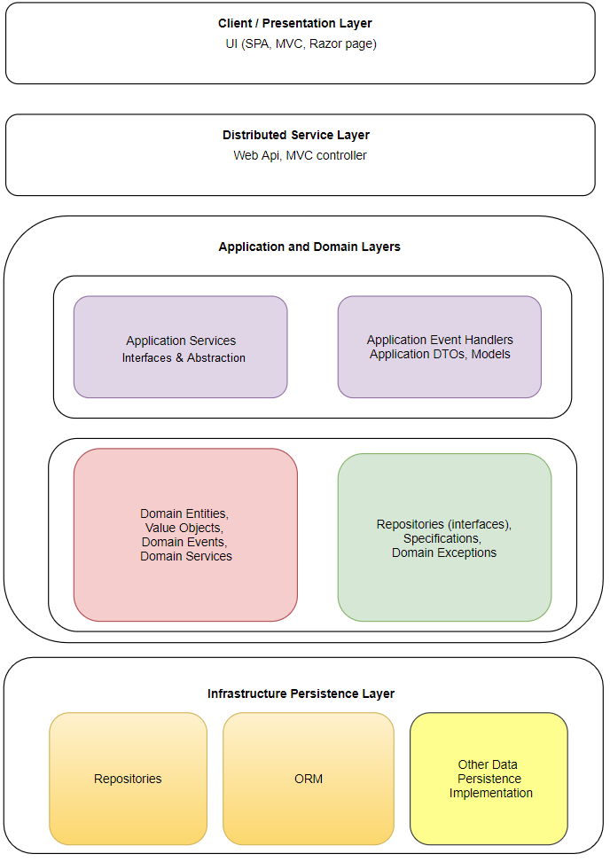

### Major layers in Domain Driven Design

- **Presentation Layer**: Graphical user interface, focus on handling the interaction between the user and the application.
- **Application layer**:  Offers a middle ground to orchestrate or organize the interaction between domains and respoistories
- **Domain layer**: Contains the business objects, business logics and in-proc domain events.
- **Infrastructure Persistence layer**: Responsible for Data persistence and Data access

